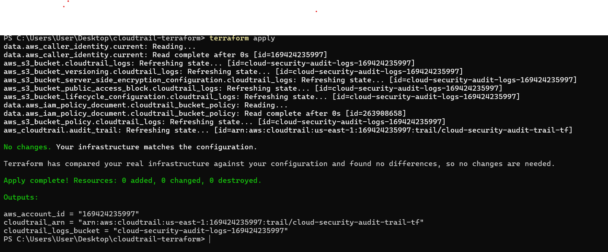
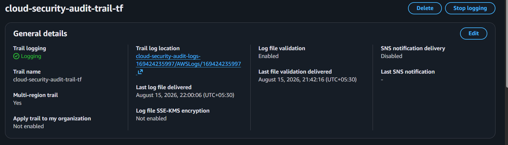
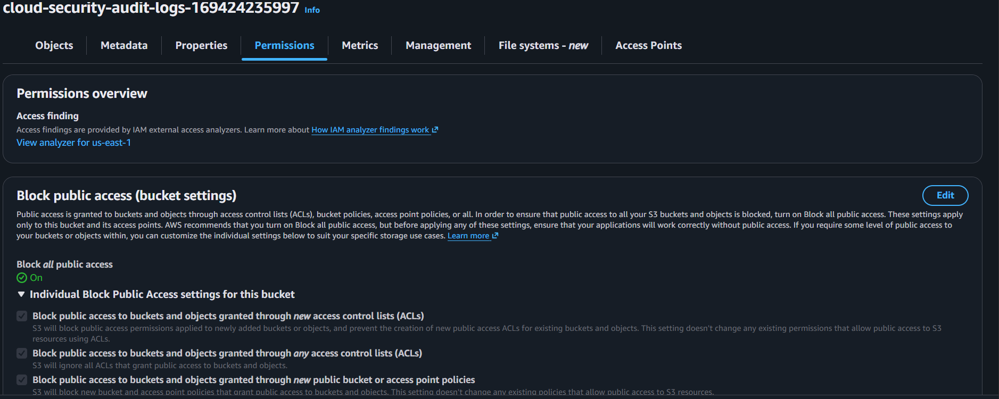

# Cloud Security Audit & Compliance Logging Platform — Terraform (IaC)

Terraform code jo ek multi-layer AWS security monitoring setup ko
infrastructure-as-code mein deploy karta hai. Poora setup pehle AWS Console
se manually banaya gaya tha, ab reusable aur version-controlled hai.

## Kya banega

**1. CloudTrail — Audit logging**
- Multi-region trail, Management events (Read + Write)
- Encrypted S3 bucket (SSE-S3), public access blocked, versioning on
- Log file validation enabled (tamper-detection)
- Lifecycle rule — 30 din baad Glacier, 90 din baad auto-expire

**2. GuardDuty — Threat detection**
- Foundational detector (CloudTrail/VPC/DNS-based threat analysis)
- Koi paid add-on nahi (S3 Protection, Malware Protection, EKS Protection — sab skip kiye)

**3. IAM Access Analyzer — External exposure detection**
- Account-level external access analyzer
- Detect karta hai agar koi resource (S3, IAM role, KMS key) galti se account ke bahar accessible ho

**4. AWS Config — Resource configuration tracking**
- Scoped sirf IAM (Users/Roles/Policies) aur S3 buckets tak — poore account tak nahi (cost control ke liye)
- Dedicated encrypted S3 bucket configuration snapshots ke liye
- Koi Config Rules attach nahi ki (evaluation cost avoid karne ke liye)

## Architecture at a glance

```
AWS Account
    │
    ├── CloudTrail ──────► S3 (audit logs)
    ├── GuardDuty ───────► Threat findings
    ├── IAM Access Analyzer ► External exposure findings
    └── AWS Config ──────► S3 (config snapshots, IAM + S3 scope)
```

## Prerequisites

1. [Terraform](https://developer.hashicorp.com/terraform/install) installed (v1.5+)
2. AWS CLI configured with credentials:
   ```
   aws configure
   ```
   (IAM user ka access key/secret use karo, root account ka nahi)

## Kaise chalayein

```bash
terraform init      # providers download honge
terraform plan       # dekho kya banega, bina apply kiye
terraform apply       # confirm karke resources create honge
```

Apply hone ke baad Terraform sab service outputs (bucket names, ARNs, detector IDs) print karega.

Sab hata na ho toh:

```bash
terraform destroy
```

## Cost notes

| Service | Cost |
|---|---|
| CloudTrail | Management events ki first copy free hai |
| S3 (dono buckets) | Chhoti log volume ke liye negligible (~cents/month) |
| GuardDuty | 30-day free trial, uske baad usage-based (low-traffic account mein bahut kam) |
| IAM Access Analyzer | **Completely free** (external access analyzer type) |
| AWS Config | ~$0.003 per configuration item, scoped sirf IAM+S3 tak (cost minimize karne ke liye) |

Koi bhi resource jo cost badhata (RDS, NAT Gateway, Load Balancer, EC2) — jaan-bujh kar avoid kiya gaya.

## Real debugging encountered

Deployment ke dauraan `InsufficientS3BucketPolicyException` mila — root cause: CloudTrail resource mein extra `s3_key_prefix = "AWSLogs"` set kiya tha, jabki AWS khud automatically `AWSLogs/<account-id>/...` path use karta hai. Isse actual write path aur bucket policy ke allowed path mein mismatch ho gaya tha. Fix: redundant `s3_key_prefix` hataya, path match ho gaya.

## Screenshots

**Terraform apply — successful deployment**


**CloudTrail verified in AWS Console**


**S3 bucket security settings**


## Portfolio ke liye

Isse tumhara "I clicked buttons in console" project "I write infrastructure
as code" project ban jaata hai — recruiters isko differently dekhte hain.
